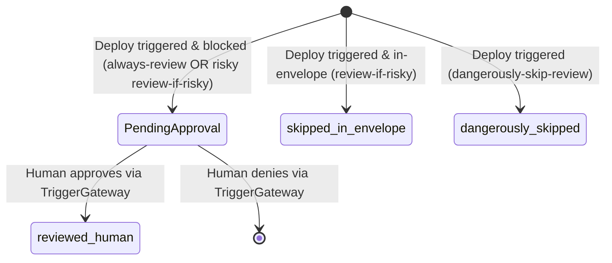

# Data Model: Review Modes and Deterministic Envelope Predicate

This document describes the state models and schemas introduced for the deploy-time review rail.

## Entities

### 1. DeployProvenance

Represents the recorded deployment history of an agent manifest.

- **Storage**: Keyed by the `agent_name` (string) inside the single-writer `"provenance"` `AgentOS.StateStore`.
- **Fields**:
  - `status`: `:reviewed_human` | `:skipped_in_envelope` | `:dangerously_skipped`
  - `hash`: SHA-256 hex string (uppercase) computed from the manifest file content at the time of the check.

#### State Transitions

### 2. PendingDeployApproval

Represents a blocked deployment parking for human approval.

- **Storage**: Keyed by unique `ref` string inside the `"pending_approvals"` `AgentOS.StateStore` under the `:approvals` map.
- **Fields**:
  - `ref`: String (e.g. `ref_deploy_discovery_12345`)
  - `action`: `AgentOS.ProposedAction` map
    - `type`: `"deploy"`
    - `recipient`: `agent_name` (string)
    - `method`: `manifest_path` (string)
    - `payload`: `%{ "review_mode" => string, "hash" => string }`
  - `grant`: `AgentOS.Manifest.Grant` map
    - `connector`: `"deploy"`
    - `recipients`: `nil`
    - `methods`: `nil`

## Validation Rules

### Envelope Predicate
A manifest matches the envelope (`in_envelope? == true`) iff:
1. **Read-only**: All manifest grants resolve to connectors with registry metadata `mutating? == false` (or danger tier `:read_only`).
2. **No-egress**: All manifest grants resolve to danger tiers other than `:external` (allowing only `:read_only` and `:local` danger tiers).
3. **Spend-under-threshold**: The manifest spend cap is `<= 100,000` micro-dollars ($0.10 USD).
