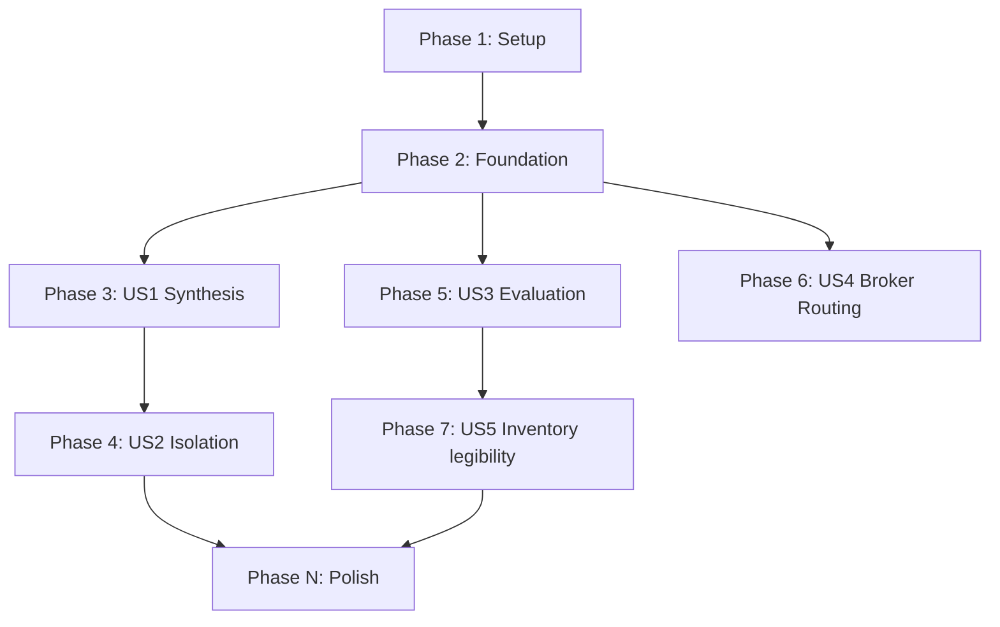

# Tasks: Stage 3 Write the Judge (write-judge)

**Input**: Design documents from `/specs/014-write-judge/`
**Prerequisites**: plan.md (required), spec.md (required), research.md, data-model.md, contracts/

**Tests**: Included. ExUnit tests are mapped for each user story phase to ensure verification of both synthesis and evaluation stages.

**Organization**: Tasks are grouped by user story to enable independent implementation and testing of each story.

## Format: `[ID] [P?] [Story] Description`

- **[P]**: Can run in parallel (different files, no dependencies)
- **[Story]**: Which user story this task belongs to (e.g., US1, US2, US3)
- Include exact file paths in descriptions

## Path Conventions

- Paths assume a single project structure matching Elixir `lib/` and `test/` layout at repository root.

---

## Phase 1: Setup (Shared Infrastructure)

**Purpose**: Register the new StateStore named collection for persisting judge verdicts.

- [x] T001 Register the "judge_results" StateStore collection under children in `lib/agent_os/application.ex`
- [x] T002 Configure file path for "judge_results" in `lib/agent_os/application.ex` and config setups

---

## Phase 2: Foundational (Blocking Prerequisites)

**Purpose**: Establish core data models and serialization checks before implementing individual stories.

- [x] T003 [P] Define `AgentOS.Pipeline.Stage3.TestCase`, `TestSpec`, and `Verdict` structs in `lib/agent_os/pipeline/stage3_judge.ex`
- [x] T004 Implement JSON encoder/decoder helper for parsing the test spec format in `lib/agent_os/pipeline/stage3_judge.ex`

**Checkpoint**: Foundation ready - user story implementation can begin.

---

## Phase 3: User Story 1 - Synthesise a test spec from the manifest and purpose (Priority: P1)

**Goal**: Generate a structured `judge_spec.json` containing test cases from a manifest and purpose.

**Independent Test**: Programmatically call `AgentOS.Pipeline.Stage3.generate/3` with a mock manifest and verify that a valid, schema-conforming JSON file is emitted.

### Implementation for User Story 1

- [x] T005 [P] [US1] Author prompt templates for test scenario synthesis (synthesis prompt) in `lib/agent_os/pipeline/stage3_judge.ex`
- [x] T006 [US1] Implement `AgentOS.Pipeline.Stage3.generate/3` to invoke the broker and write results to file path `agents/<agent_name>/judge_spec.json` in `lib/agent_os/pipeline/stage3_judge.ex`
- [x] T007 [P] [US1] Add unit tests for `generate/3` verifying file creation and JSON schema validity in `test/agent_os/pipeline/stage3_judge_test.exs`

**Checkpoint**: User Story 1 is functional. The judge spec can be generated for any manifest.

---

## Phase 4: User Story 2 - Resolve the co-generation caveat via independent derivation (Priority: P1)

**Goal**: Prevent spec-misread propagation by isolating the judge from Stage 1 conversation transcripts and isolating Stage 4 from the judge spec.

**Independent Test**: Verify that the context parameters of `generate/3` exclude transcripts and verify Stage 4 prompts do not read `judge_spec.json`.

### Implementation for User Story 2

- [x] T008 [US2] Enforce runtime and compiler checks on `generate/3` to reject conversational transcript maps or logs in `lib/agent_os/pipeline/stage3_judge.ex`
- [x] T009 [P] [US2] Create negative tests asserting that compiling/running Stage 4 does not load or leak the test cases in `test/agent_os/pipeline/stage3_judge_test.exs`

**Checkpoint**: Context and information isolation boundaries are verified.

---

## Phase 5: User Story 3 - LLM-as-judge scoring with honest scoping (Priority: P1)

**Goal**: Execute the agent and score manifest compliance via LLM-as-judge, including the required disclaimer.

**Independent Test**: Run the judge runner against conforming and non-conforming mock agents, confirming they receive the correct pass/fail verdicts and disclaimers.

### Implementation for User Story 3

- [x] T010 [P] [US3] Author prompt templates for LLM-as-judge scoring including the disclaimer in `lib/agent_os/pipeline/stage3_judge.ex`
- [x] T011 [US3] Implement `AgentOS.Pipeline.Stage3.run/2` executing the agent in a sandboxed port and collecting execution trace in `lib/agent_os/pipeline/stage3_judge.ex`
- [x] T012 [US3] Integrate verdict persistence to write to `"judge_results"` in `StateStore` after runner completion in `lib/agent_os/pipeline/stage3_judge.ex`
- [x] T013 [P] [US3] Add unit/integration tests for `run/2` using mock agent port outputs in `test/agent_os/pipeline/stage3_judge_test.exs`

**Checkpoint**: The judge can run and evaluate agents, persisting results.

---

## Phase 6: User Story 4 - Route through the single inference chokepoint (Priority: P1)

**Goal**: Route all model calls (synthesis and evaluation) through `AgentOS.InferenceBroker` and fail safe on errors.

**Independent Test**: Assert that all judge-related LLM calls route through `InferenceBroker.complete/2` and that timeouts result in safe `:error` verdicts.

### Implementation for User Story 4

- [x] T014 [US4] Bind all LLM-as-judge evaluation calls to `AgentOS.InferenceBroker.complete/2` in `lib/agent_os/pipeline/stage3_judge.ex`
- [x] T015 [P] [US4] Add test cases asserting that network errors or spend cap breaches result in safe `:error` verdicts in `test/agent_os/pipeline/stage3_judge_test.exs`

**Checkpoint**: Metering and credential isolation are verified.

---

## Phase 7: User Story 5 - Surfacing judge results in the standing inventory (Priority: P2)

**Goal**: Surface the latest judge status and disclaimer text in the standing inventory.

**Independent Test**: Verify `AgentOS.Inventory.render/1` renders the `JUDGE` status correctly for `unrun`, `pass`, and `fail` states.

### Implementation for User Story 5

- [x] T016 [US5] Modify `AgentOS.Inventory.render/1` to query the `"judge_results"` snapshot and format outputs in `lib/agent_os/inventory.ex`
- [x] T017 [P] [US5] Add unit tests for inventory formatting of judge results in `test/agent_os/inventory_test.exs`

**Checkpoint**: Standing inventory legibility updates are verified.

---

## Phase N: Polish & Cross-Cutting Concerns

**Purpose**: Format cleanups, linting, and final end-to-end local test suite run.

- [x] T018 [P] Run `mix format` and `mix test` to verify zero compiler warnings and zero failures
- [x] T019 Execute and validate programmatic code flows described in `quickstart.md`

---

## Dependencies & Execution Order

### Phase Dependencies

- **Setup (Phase 1)**: No dependencies - can start immediately.
- **Foundational (Phase 2)**: Depends on Setup - BLOCKS all user stories.
- **User Stories (Phase 3+)**: Depend on Foundational completion.
  - Phase 3 (US1), Phase 5 (US3), Phase 6 (US4) are critical path.
  - Phase 4 (US2) and Phase 7 (US5) can run in parallel with their companion stories.
- **Polish (Final Phase)**: Depends on all user stories completing.

### User Story Dependencies

### Parallel Opportunities

- Registering StateStore (T001) and configuring paths (T002) can run in parallel.
- Struct definition (T003) can run in parallel with JSON encoder helpers (T004).
- Tests (T007, T009, T013, T015, T017) can be run concurrently with their implementation tasks.

---

## Implementation Strategy

### MVP First (User Stories 1 & 3)

1. Complete Phase 1: Setup.
2. Complete Phase 2: Foundational.
3. Complete Phase 3: User Story 1 (Synthesis to disk).
4. Complete Phase 5: User Story 3 (Run evaluation).
5. Complete Phase 6: User Story 4 (Broker integration).
6. **STOP and VALIDATE**: Verify mock agent compliance runs cleanly.

### Incremental Delivery

1. Setup + Foundation -> Infrastructure ready.
2. Add US1 (Synthesis) -> Verify `judge_spec.json` output.
3. Add US3 (Evaluation) -> Verify test runner runs agent and writes verdict.
4. Add US2 (Isolation boundaries) -> Verify context parameters are safe.
5. Add US5 (Inventory legibility) -> Verify status rendering.
