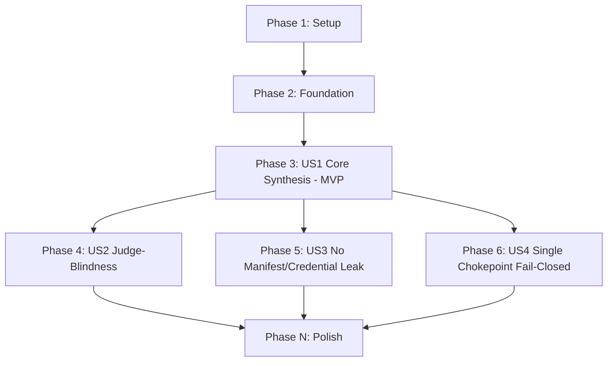

# Tasks: Stage 4 Write the Novel Agent Body (write-novel-agent)

**Input**: Design documents from `/specs/015-write-novel-agent/`
**Prerequisites**: plan.md (required), spec.md (required), research.md, data-model.md, contracts/

**Tests**: Included. Backend Elixir logic is TDD per Constitution III — every story phase below
includes test tasks that must be written and FAIL before the corresponding implementation task lands.

**Organization**: Tasks are grouped by user story to enable independent implementation and testing of each story.

## Format: `[ID] [P?] [Story] Description`

- **[P]**: Can run in parallel (different files, no dependencies)
- **[Story]**: Which user story this task belongs to (e.g., US1, US2, US3)
- Include exact file paths in descriptions

## Path Conventions

- Paths assume a single project structure matching Elixir `lib/` and `test/` layout at repository root.
- All implementation tasks land in the single new file `lib/agent_os/pipeline/stage4_agent.ex`, so
  tasks that touch that file are sequenced (not `[P]`) against each other even when logically
  independent, to avoid concurrent edits to the same file. Test tasks land in the single new file
  `test/agent_os/pipeline/stage4_agent_test.exs` and are sequenced against each other for the same
  reason, but a test task CAN run in parallel with the implementation task of an *earlier, already-
  complete* story.

---

## Phase 1: Setup (Shared Infrastructure)

**Purpose**: Create the module and test file skeletons. No new StateStore collection, no new
dependency, no new top-level directory (per plan.md's Constitution Check, Principle IX row).

- [x] T001 Create `lib/agent_os/pipeline/stage4_agent.ex` with a `@moduledoc` describing Stage 4
      (novel synthesis, judge-blindness, manifest-not-readable, single chokepoint — mirroring the
      moduledoc style of `lib/agent_os/pipeline/stage3_judge.ex`) and an empty
      `AgentOS.Pipeline.Stage4` module shell
- [x] T002 [P] Create `test/agent_os/pipeline/stage4_agent_test.exs` with an ExUnit setup block
      mirroring `test/agent_os/pipeline/stage3_judge_test.exs`: a tmp `spec_dir`, supervised
      `Registry`/`StateStore` (`"spend_ledger"` only — no `"judge_results"` collection is needed by
      this feature), supervised `AgentOS.CredentialProxy` and `AgentOS.InferenceBroker`, a sample
      `%AgentOS.Manifest{}` fixture with at least one grant, and a registered run token

**Checkpoint**: Setup complete — module and test file exist and compile (empty).

---

## Phase 2: Foundational (Blocking Prerequisites)

**Purpose**: Typed structs and the JSON-parse helper every user story's `generate/3` path depends on.

**⚠️ CRITICAL**: No user story work can begin until this phase is complete

- [x] T003 Define `AgentOS.Pipeline.Stage4.GeneratedFile` (`path`, `content`) and
      `AgentOS.Pipeline.Stage4.AgentBody` (`agent_name`, `purpose`, `files`) structs with
      `@enforce_keys` and `@type`, per [data-model.md](./data-model.md), in
      `lib/agent_os/pipeline/stage4_agent.ex`
- [x] T004 Implement `parse_files/1`, decoding the broker's `{"files": [{"path":..., "content":...}]}`
      completion into `[GeneratedFile.t()]`, returning `{:error, :invalid_synthesis_output}` (not
      raising) on malformed JSON or a malformed entry — mirrors `Stage3.parse_tests/1`'s pattern, in
      `lib/agent_os/pipeline/stage4_agent.ex`

**Checkpoint**: Foundation ready - user story implementation can now begin.

---

## Phase 3: User Story 1 - Synthesise a novel agent body from purpose + manifest (Priority: P1) 🎯 MVP

**Goal**: `AgentOS.Pipeline.Stage4.generate/3` takes `agent_name` + `manifest`, authors a prompt,
calls the broker once, parses the response, runs the path-safety / typed-contract / syntax guards,
and writes `agents/<agent_name>/main.py` + `agents/<agent_name>/models.py`.

**Independent Test**: Call `generate/3` with a stub `provider_fn` returning a valid two-file JSON
completion; assert both files are written under the configured `spec_dir`, a typed `AgentBody` is
returned, and two distinct stub completions (standing in for two distinct purposes) produce
materially different file contents.

### Tests for User Story 1 ⚠️

> **NOTE: Write these tests FIRST, ensure they FAIL before implementation**

- [x] T005 [US1] Add test: `generate/3` with a valid stub completion writes `main.py` and `models.py`
      under `spec_dir/<agent_name>/` and returns `{:ok, %AgentBody{}}` with both files present, in
      `test/agent_os/pipeline/stage4_agent_test.exs`
- [x] T006 [US1] Add test: two `generate/3` calls with two different stub completions (representing
      two different purposes) yield two `AgentBody` results whose `files` content differs, in
      `test/agent_os/pipeline/stage4_agent_test.exs`
- [x] T007 [US1] Add tests: malformed JSON completion, an unsafe file path (contains `/` or `..`, or
      doesn't end `.py`), a `main.py` missing the typed stdin/stdout contract, and invalid Python
      syntax in any file are each rejected with a guard-specific `{:error, reason}` and **no file
      written** for that run, in `test/agent_os/pipeline/stage4_agent_test.exs`

### Implementation for User Story 1

- [x] T008 [US1] Implement `synthesis_messages/2`, building the system/user prompt from
      `agent_name` and `manifest` — reusing `AgentOS.CapabilityRender.render/1` for the grant
      summary and embedding the `INFERENCE_SOCKET`/`RUN_TOKEN` UDS reference snippet (sourced from
      `agents/discovery/main.py`'s broker-call pattern) as a copy-pasteable example, per
      [research.md](./research.md)'s "Synthesis Prompt Design" section, in
      `lib/agent_os/pipeline/stage4_agent.ex`
- [x] T009 [US1] Implement `guard_path_safety/1`, rejecting any `GeneratedFile.path` containing `/`
      or `..`, or not ending in `.py`, returning `{:error, :unsafe_path}`, in
      `lib/agent_os/pipeline/stage4_agent.ex`
- [x] T010 [US1] Implement `guard_typed_contract/1`, checking `main.py`'s content for evidence of a
      `pydantic`/`BaseModel` import, a `sys.stdin` read, and a JSON stdout emit, returning
      `{:error, :missing_typed_contract}` on failure, in `lib/agent_os/pipeline/stage4_agent.ex`
- [x] T011 [US1] Implement `guard_python_syntax/1`, shelling out via `AgentOS.PortRunner` to
      `python3 -c "import ast,sys; ast.parse(sys.stdin.read())"` for each `.py` file's content,
      returning `{:error, :invalid_python_syntax}` on a non-zero exit, in
      `lib/agent_os/pipeline/stage4_agent.ex`
- [x] T012 [US1] Implement `generate/3`, wiring `require_token` → `broker_complete` (via
      `AgentOS.InferenceBroker.complete/2`) → `parse_files` → `guard_path_safety` →
      `guard_typed_contract` → `guard_python_syntax` → atomic write of both files under
      `Path.join([spec_dir, agent_name])` (default `spec_dir` `"agents"`, mirroring
      `Stage3.write_spec/3`'s convention) → `{:ok, %AgentBody{}}`, with every guard short-circuiting
      to `{:error, reason}` and no write on failure, in `lib/agent_os/pipeline/stage4_agent.ex`

**Checkpoint**: At this point, User Story 1 should be fully functional and testable independently — this is the MVP.

---

## Phase 4: User Story 2 - Generated blind to the judge (Priority: P1)

**Goal**: Prove `generate/3` never reads `judge_spec.json` and that its presence on disk does not
affect the synthesis result.

**Independent Test**: Place a `judge_spec.json` fixture at `agents/<agent_name>/judge_spec.json`
before calling `generate/3` with a fixed stub `provider_fn`; assert the returned `AgentBody` and
written files are identical to a run where no such fixture exists.

### Tests for User Story 2 ⚠️

- [x] T013 [US2] Add test: with a `judge_spec.json` fixture present at
      `spec_dir/<agent_name>/judge_spec.json` before the call, `generate/3` (fixed stub
      `provider_fn`) returns the same `AgentBody` content as a run with no such fixture present —
      directly verifying SC-004, in `test/agent_os/pipeline/stage4_agent_test.exs`

### Implementation for User Story 2

- [x] T014 [US2] Add an inline comment at the top of `AgentOS.Pipeline.Stage4` documenting the
      judge-blindness invariant — `generate/3`'s signature (`agent_name`, `manifest`, `opts`) has no
      slot capable of carrying judge-spec content, and the implementation must never call `File.read`
      against any path other than the two files it writes — per [research.md](./research.md)'s
      "Judge-Blindness" section, in `lib/agent_os/pipeline/stage4_agent.ex`

**Checkpoint**: Judge-blindness is verified by test, not just by convention (SC-004).

---

## Phase 5: User Story 3 - The body holds no manifest and no credential (Priority: P1)

**Goal**: The emitted body cannot contain a manifest literal, spend value, grant detail, or
credential-shaped string, and cannot reference a direct model-provider path.

**Independent Test**: Feed `generate/3` a stub completion whose content embeds the manifest's
spend cap (or a grant's connector/recipient literal, or a credential-shaped string, or a direct
provider hostname); assert each case is rejected with no file written, while a clean completion
referencing only `INFERENCE_SOCKET` passes.

### Tests for User Story 3 ⚠️

- [x] T015 [US3] Add tests: a stub completion whose content contains the manifest's `spend.cap`
      literal, a grant's `connector`/recipient/method literal, or a credential-shaped string (e.g.
      `api_key = "..."`) is rejected with `{:error, :manifest_leak_detected}` and no file written, in
      `test/agent_os/pipeline/stage4_agent_test.exs`
- [x] T016 [US3] Add tests: a stub completion referencing a direct provider hostname/SDK (e.g.
      `openai`, `api.openai.com`) is rejected with `{:error, :direct_provider_path_detected}` and no
      file written; a stub completion whose only network reference is `INFERENCE_SOCKET` passes this
      guard, in `test/agent_os/pipeline/stage4_agent_test.exs`

### Implementation for User Story 3

- [x] T017 [US3] Implement `guard_no_manifest_leak/2`, checking the concatenated content of all
      generated files against the manifest's `spend.cap` literal, each grant's
      `connector`/recipient/method literal, and a small set of credential-shaped regex patterns,
      returning `{:error, :manifest_leak_detected}` on a match, in
      `lib/agent_os/pipeline/stage4_agent.ex`
- [x] T018 [US3] Implement `guard_no_direct_provider/1`, checking the concatenated content against a
      provider hostname/SDK denylist and confirming any network-shaped reference uses
      `INFERENCE_SOCKET`, returning `{:error, :direct_provider_path_detected}` on a match, in
      `lib/agent_os/pipeline/stage4_agent.ex`
- [x] T019 [US3] Wire `guard_no_manifest_leak/2` and `guard_no_direct_provider/1` into `generate/3`'s
      guard pipeline (after `guard_typed_contract`, before `guard_python_syntax`), in
      `lib/agent_os/pipeline/stage4_agent.ex`

**Checkpoint**: The emitted body is provably manifest- and credential-free, and provably routes
inference only through `INFERENCE_SOCKET`.

---

## Phase 6: User Story 4 - Untrusted code, single generation chokepoint (Priority: P2)

**Goal**: The authoring call routes exclusively through `AgentOS.InferenceBroker.complete/2`, fails
closed on any broker failure (timeout, error, spend breach), and Stage 4 itself holds no model
credential.

**Independent Test**: Assert a missing run token, a broker timeout/error, and a `{:breach, :spend}`
each fail `generate/3` closed with no file written, and that the stub `provider_fn` is the sole
call-site exercised during a successful run (i.e. no second network-shaped call is made by Stage 4
itself).

### Tests for User Story 4 ⚠️

- [x] T020 [US4] Add tests: no `:run_token` opt, a `provider_fn` that returns a broker timeout/error
      shape, and a `provider_fn` shape that the broker resolves to `{:breach, :spend}` each cause
      `generate/3` to return `{:error, reason}` with no file written, in
      `test/agent_os/pipeline/stage4_agent_test.exs`

### Implementation for User Story 4

- [x] T021 [US4] Implement `broker_complete/2`, requiring `:run_token`, forwarding test-seam opts
      (`:provider_fn`, `:prices`, `:now`) to `AgentOS.InferenceBroker.complete/2`, and mapping
      `{:breach, :spend}` / timeout / error results to `{:error, reason}` with no write — wired as
      the sole network-shaped call in `generate/3`, in `lib/agent_os/pipeline/stage4_agent.ex`

**Checkpoint**: All P1/P2 user stories are independently implemented and verified.

---

## Phase N: Polish & Cross-Cutting Concerns

**Purpose**: Format, lint, and validate the documented usage flow.

- [x] T022 [P] Run `mix format` and Credo against `lib/agent_os/pipeline/stage4_agent.ex` and
      `test/agent_os/pipeline/stage4_agent_test.exs`; confirm zero warnings and `mix test` passes
      with zero failures
- [x] T023 Walk through [quickstart.md](./quickstart.md)'s documented usage flow (minimal usage,
      stubbed-test usage, judge-blindness verification) against the implemented module and confirm
      it matches exactly as written

---

## Dependencies & Execution Order

### Phase Dependencies

- **Setup (Phase 1)**: No dependencies - can start immediately.
- **Foundational (Phase 2)**: Depends on Setup - BLOCKS all user stories.
- **User Stories (Phase 3+)**: Depend on Foundational completion.
  - Phase 3 (US1) is the critical path and the MVP — every later phase extends the `generate/3`
    pipeline US1 builds.
  - Phase 4 (US2), Phase 5 (US3), and Phase 6 (US4) each add guards/wiring on top of the US1
    pipeline; they are independently testable but not independently *buildable* before US1 exists
    (the function they extend doesn't exist yet).
- **Polish (Final Phase)**: Depends on all four user stories completing.

### User Story Dependencies

### Parallel Opportunities

- T001 (module skeleton) and T002 (test file skeleton) can run in parallel — different files.
- Within Phase 2, T003 (structs) and T004 (parse helper) both touch the same new file; sequence
  them (T003 then T004) rather than running in parallel.
- Once US1 (Phase 3) is complete, US2/US3/US4's *test* tasks (T013, T015, T016, T020) can be
  written in parallel with each other (all touch the same test file, so in practice sequence them
  within that file, but they have no logical dependency on one another) — their *implementation*
  tasks (T014, T017–T019, T021) all touch the single `stage4_agent.ex` file and should be applied
  in task-ID order to avoid conflicting edits.
- T022 (format/lint) can run in parallel with starting T023 (quickstart walkthrough), since they
  touch disjoint concerns (tooling vs. manual verification).

---

## Implementation Strategy

### MVP First (User Story 1 Only)

1. Complete Phase 1: Setup.
2. Complete Phase 2: Foundational.
3. Complete Phase 3: User Story 1 — `generate/3` synthesises, structurally validates, and writes a
   novel agent body.
4. **STOP and VALIDATE**: Run the Phase 3 tests; confirm `agents/<agent_name>/{main.py,models.py}`
   are written for a stubbed completion and rejected (with no write) for each malformed-output case.

### Incremental Delivery

1. Setup + Foundational → infrastructure ready (structs, parse helper).
2. Add US1 → `generate/3` exists end-to-end (MVP: novel synthesis, path/contract/syntax guards).
3. Add US2 → judge-blindness is asserted by test, not just by the absence of a code path.
4. Add US3 → manifest/credential-leak and direct-provider guards close the safety gap FR-006/008
   exist to prevent.
5. Add US4 → broker fail-closed behavior is asserted for every failure mode (token, timeout, error,
   breach).
6. Polish → lint clean, `mix test` green, quickstart.md verified against the real implementation.
